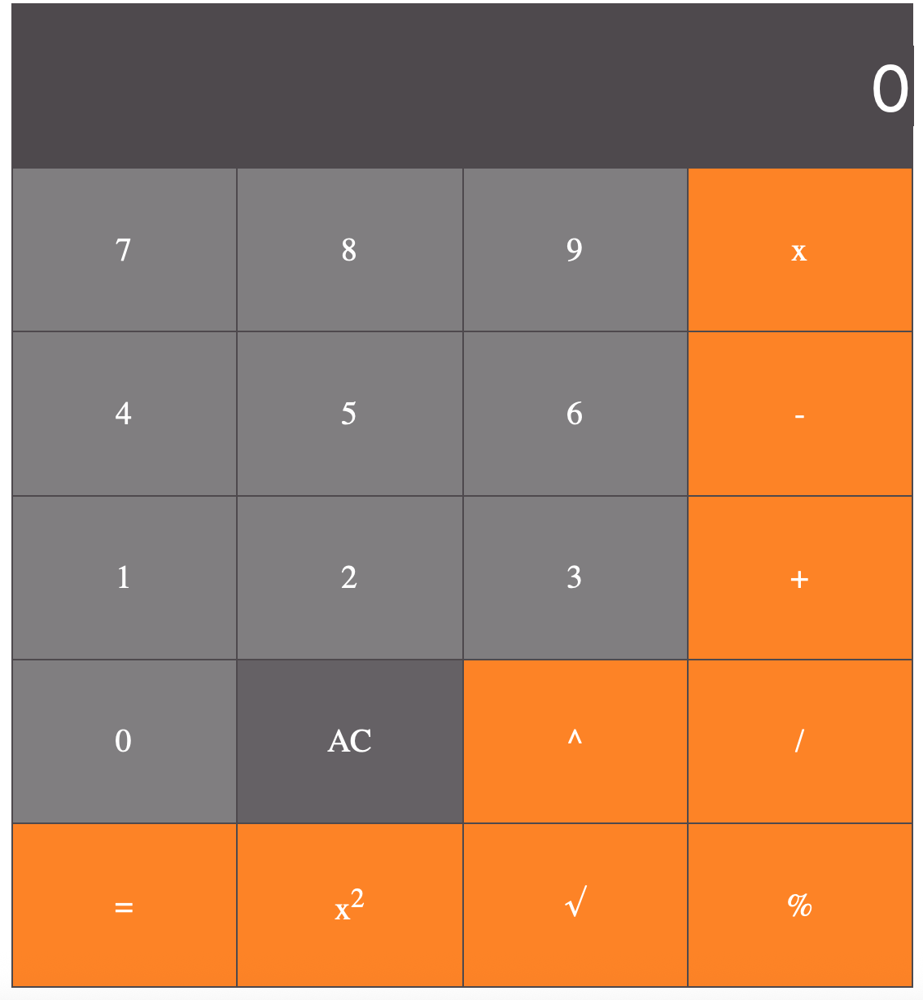

# 📱 Calculator App

A simple yet powerful web-based calculator built using **HTML**, **CSS**, and **JavaScript**.

This calculator handles both **basic** and **advanced** arithmetic operations through a clean and intuitive interface.

---

## 🚀 Features

- ✅ Addition, Subtraction, Multiplication, Division  
- ✅ **Modulus (%)** operator  
- ✅ **Square (x²)** and **Square Root (√x)** functions  
- ✅ **Exponentiation (xʸ)** using power function  
- ✅ Keyboard input support  
- ✅ Responsive design (mobile & desktop)  
- ✅ Real-time input and output display  

---

## 📸 Screenshot


---

## 🛠️ Technologies Used

- HTML5  
- CSS3  
- JavaScript (Vanilla)

---

## 📂 How to Run Locally

1. **Clone this repository**:
   ```bash
   git clone https://github.com/your-username/calculator-app.git

